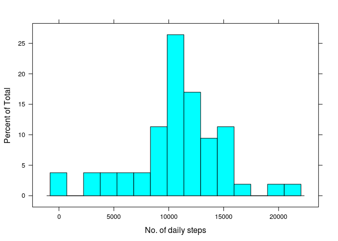
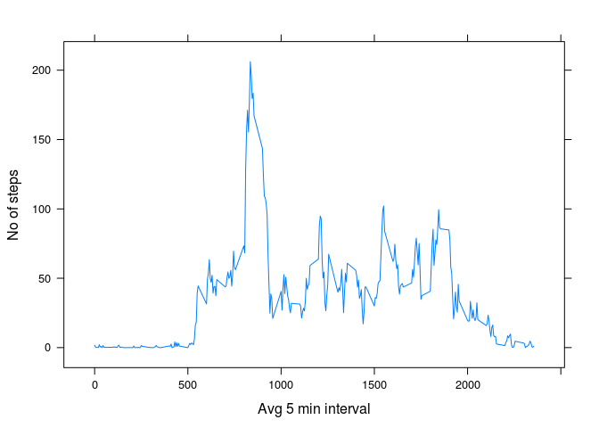
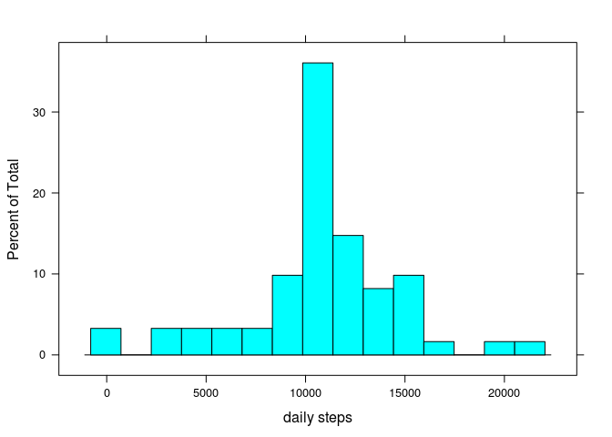
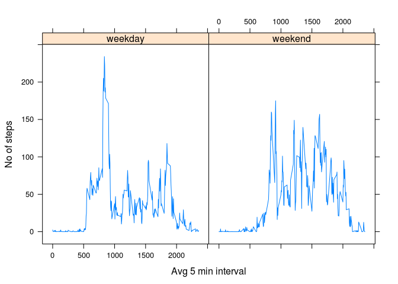

# Reproducible Research: Peer Assessment 1

Note: The figures are plotted in the html file but also saved in order under the Figures folder. They are named as Fig 1, 2, 3, 4 in the order in which they are plotted here

## Loading and preprocessing the data from local git repository
The git repository is cloned, data is loaded and NA values removed


```r
setwd("~/Projects/DaSci/RR/RepData_PeerAssessment1")
activity1 <-read.csv("activity.csv")
activity <- na.omit(activity1)
activity$date<-as.Date(activity$date)
```

## Calculate the mean total number of steps taken per day
Using the lattice library for plotting, aggregating steps by days  
No separate png file for plotting as html prints plots too

```r
library(lattice)

steps_day<-aggregate(steps ~ date, activity, sum)
histogram(steps_day$steps, xlab = 'No. of daily steps', n = 15)
```

 

```r
mean_steps <- mean(steps_day$steps)
median_steps <- median(steps_day$steps)

print(mean_steps)
```

```
## [1] 10766.19
```

```r
print(median_steps)
```

```
## [1] 10765
```
## The average daily activity pattern
Number of steps are aggregated by interval to plot average daily activity pattern  
Interval with most number of steps is printed out


```r
mean_interval<-aggregate(steps ~ interval, activity, mean)
xyplot(steps ~ interval, mean_interval, type = 'l', xlab ="Avg 5 min interval", ylab ="No of steps")
```

 

```r
i = which.max(mean_interval[,2])
print(mean_interval[i,])
```

```
##     interval    steps
## 104      835 206.1698
```
## Imputing missing values
Data without NA values was used so far. The number of NA values are found out. The mean_interval dataframe used previously gives the mean value for every interval averaged across all days. The next piece of code chunk replaces each missing value for steps for a given interval with the average value for that interval.


```r
activity_na<-subset(activity1, is.na(steps))
print (nrow(activity_na))
```

```
## [1] 2304
```

```r
for (i in 1:nrow(activity1))
{
 if(is.na(activity1[i,"steps"]))
   {
     x = activity1[i, "interval"] 
     activity1[i,"steps"] = mean_interval[mean_interval$interval == x, 2]
   }
}
```

# Calculating summaries with new data
The histogram for daily activity and mean and median are calculated with new data where NAs are removed


```r
steps_day1<-aggregate(steps ~ date, activity1, sum)
histogram(steps_day1$steps, xlab = 'daily steps', n = 15)
```

 

```r
mean_steps1 <- mean(steps_day1$steps)
median_steps1 <- median(steps_day1$steps)

print(abs(mean_steps - mean_steps1))
```

```
## [1] 0
```

```r
print(abs(median_steps - median_steps1))
```

```
## [1] 1.188679
```

As mean value was used to replace the NAs the mean does not change, there is a slight change in the median value


## Activity patterns, Weekday vs Weekends

Function weekdays is used to identify the days and converted to two factors using level transformation


```r
activity[,"day_type"] = as.factor(weekdays(activity[,"date"]))
levels(activity$day_type)[c(1:2,5:7)] = "weekday"
levels(activity$day_type)[2:3] = "weekend"
```
This updated dataframe contains column day_type which is used for the next plot to examine difference between weekdays and weekend activity


```r
mean_interval1<-aggregate(steps ~ interval+day_type, activity, mean)
xyplot(steps ~ interval| day_type, mean_interval1 , type = 'l', xlab ="Avg 5 min interval", ylab ="No of steps")
```

 
